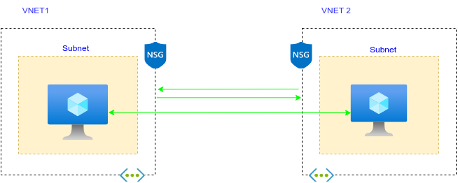

# VNet-peering
How to establish a VNet peering in a two-tier architecture.
As organizations increasingly migrate their workloads to the cloud, the need for secure, efficient, and scalable connectivity between virtual networks has become a top priority.

In Azure, Virtual Network (VNet) peering has emerged as a game-changing solution, enabling organizations to connect their VNets in a seamless and secure manner.

Especially now that, organizations are no longer confined to a single cloud or on-premises environment. With the rise of hybrid and multi-cloud deployments, the need for secure and efficient connectivity between different environments has become more pressing than ever. Azure VNet peering addresses this challenge by providing a secure, reliable, and high-performance connection between VNets.

 A common scenario that may require an organizations to make use of VNet peering  is

A global online gaming platform that uses a multi-region deployment to serve users across different geographic regions. They have data centers in:
North America (USA, Canada)
Europe (UK, Germany, France)
Asia Pacific (Japan, China, Australia)
VNet Peering Setup: Each data center is deployed in its own VNet, and VNet peering is used to connect these VNets to facilitate communication between regions. For example:
A user in North America wants to play a game with a friend in Europe. The gaming platform uses VNet peering to connect the VNets in the two regions to facilitate real-time communication between the users.
To ensure a successful VNet peering implementation in Azure, follow these essential steps:
Plan Your Network Architecture: Design your network architecture to align with your organizational needs, considering factors like routing, security, and scalability.
Configure VNet Peering Connections: Set up VNet peering connections between the required VNets, ensuring that the necessary routes and network security groups (NSGs) are in place.
Verify Connectivity: Test and verify connectivity between the peered VNets to ensure seamless communication.
Monitor and Optimize: Continuously monitor VNet peering connections and optimize them as needed to ensure optimal performance and security.
Implement Security Best Practices: Enforce robust security measures, such as NSGs, Azure Firewall, and access controls, to protect your VNet peering connection.

An example of a two-tier architecture I created was deployed in an Azure environment where two different virtual networks were made to connect with each other, enabling resources in each of the VNets to communicate as if they were within the same network.

Follow me;

1. Create Resource Groups for the VNets.
2. Create VNets and Subnets
Create two VNets and define their respective subnets. A subnet is a sub-network that can contain a subset of IP addresses within the larger IP address range defined for a VNet.

3. Create individual Virtual Machines
Create individual Virtual Machines in each VNet. Each VM will be deployed with its own NIC (Network Interface Card) that will be attached to a subnet within its respective VNet. Select an OS, in this case study I deployed a Linux server, then complete the necessary configurations for the VM (e.g. networking, security)
4. Configure NSGs (Network Security Groups)
Create NSGs and apply them to each VNet to restrict inbound and outbound traffic. Create necessary rules for allowing inbound and outbound traffic as per the security requirements (e.g. allowing traffic on TCP 3389 for remote access to the VMs).
5. Test and Verify your connection
Verify connectivity to each of the VMs by using the ping tool, once connectivity is established head over to establish peering.
6. Establish VNet Peering
To enable communication between VMs in different VNets, establish VNet peering between them and ping VNet 2 from VNet 1, then vice versa.
